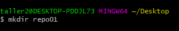
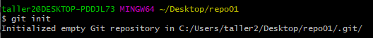
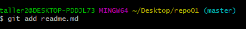
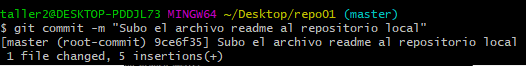
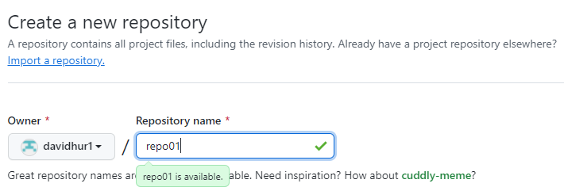
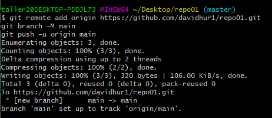
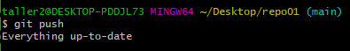
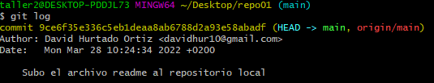
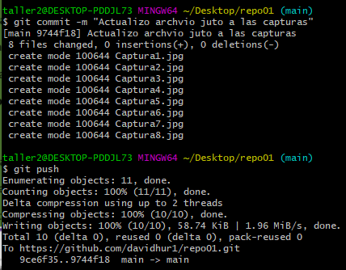

# Ejercicio git

1. Creamos un directorio llamado repo01 e iniciamos el repositorio

    
    

2. Creamos este ficher con extension .markdown

3. Añadimos el fichero al stage area y finalmente lo subimos con un commit

    
    

4. y 5 Creamos repositorio en GitHub, lo asociamos y subimos los cambios
   
    
    
    

6. Muestro la lista de commits y subo los cambios

    
    